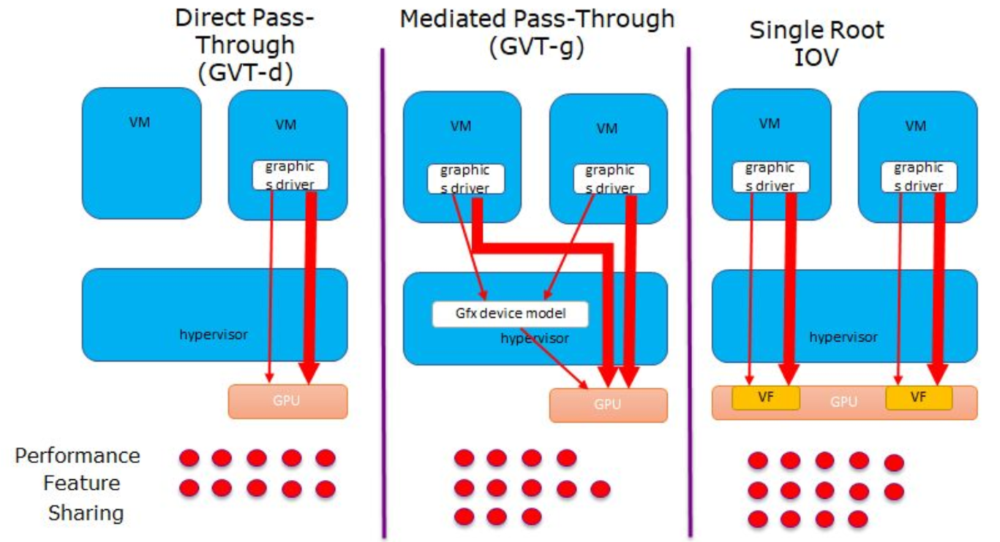

# Table of Contents
1. [Introduction](#introduction)
1. [Features Supported](#features-supported)
1. [Intel IOT Platforms Supported](#intel-iot-platforms-supported)
1. [Virtual Machine Device Model Supported](#virtual-machine-device-model-supported)
1. [Repository Layout and Naming Conventions](#repository-layout-and-naming-conventions)
1. [Host Setup](#host-setup)
    1. [Host Setup (for VMs using GVT-d)](#host-setup-for-vms-using-gvt-d)
    1. [Host Setup (for VMs using GPU SR-IOV)](#host-setup-for-vms-using-gpu-sr-iov)
1. [Virtual Machine Image Creation](#virtual-machine-image-creation)
    1. [Ubuntu/Ubuntu RT VM Image Creation](#ubuntuubuntu-rt-vm-image-creation)
    1. [Windows VM Image Creation](#windows-vm-image-creation)
    1. [Android VM Image Creation](#android-vm-image-creation)
1. [VM Definition](#vm-definition)
1. [VM Management](#vm-management)
    1. [VM vCPU Allocation](#vm-vcpu-allocation)
    1. [VM Memory Allocation](#vm-memory-allocation)
    1. [VM Launch](#vm-launch)
    1. [VM Misc Operations](#vm-misc-operations)
    1. [VM Power Management](#vm-power-management)
    1. [Automatic VM Power Management During Host Power Management](#automatic-vm-power-management-during-host-power-management)
    1. [VM Cloning](#vm-cloning)

# Introduction
This document contains setup and user guides for KVM (Kernel-based Virtual Machine) MultiOS Portfolio release.

KVM MultiOS Portfolio release provides configuration, setup and user guides for running virtual machines(VM) on Intel IOT platforms using [libvirt toolkit](https://libvirt.org/) on [KVM/QEMU](https://libvirt.org/drvqemu.html) hypervisor/emulator.

Intel IOT platform has a portfolio of graphics virtualization technologies trademarked as [Intel® Graphics Virtualization Technology™ (Intel GVT)](https://www.intel.com/content/www/us/en/virtualization/virtualization-technology/intel-virtualization-technology.html) for accelerating virtual machine workloads with GPU.
These virtualization technologies are accomplished using Intel’s foundational hardware virtualization features like [Intel® Virtualization Technology for Directed I/O (VT-d)](https://cdrdv2.intel.com/v1/dl/getContent/671081)

The different graphics virtualization technologies are:
- GVT-d or commonly known as ‘Direct Graphics Adaptor’ (vDGA) which is full device passthrough
- GVT-g which provides mediated device passthrough for Intel integrated GPUs (Broadwell till 10th generation Core processors)
- Single Root I/O Virtualization or SR-IOV which is a PCI-SIG standard  and supported by Intel integrated GPUs for 12th generation Core processors and beyond.

The below diagram shows comparision of different GPU graphics virtualization technology.


KVM MultiOS Portfolio release is targeted for newer Intel Core processors 12th gen and beyond hence GVT-g is not supported.

This documentation uses "domain" to refer to a guest virtual machine's unique name as per libvirt convention.

# Features Supported
- All VMs suspend/hibernate/resume for running VMs via single command.(Ubuntu/Windows only)
- Automatic suspend/hibernate/resume of running guest VMs during host suspend/hibernate/resume.(Ubuntu/Windows only)
- 1 step host platform configuration for running guest VMs with GVT-d or SR-IOV for GPU virtualization in guest VM.
- Automated installation process for generating guest VM image with built-in Intel GPU SR-IOV and power management support for:
    - Ubuntu 22.04
    - Windows 10 IOT Enterprise LTSC 21H2
    - Windows 11 IOT Enterprise 22H2
    - Android Celadon 12
- Launching multiple VMs with SR-IOV Multi-Display support in Guest VM GPU/display virtualization and device passthrough configuration via single command.

# Intel IOT Platforms Supported
| Supported Intel IOT platform | Supported Host and Guest OS Details | Comment
| :-- | :-- | :--
| Arrow Lake | [refer here](platforms.md#arrow-lake) |
| Amston Lake | [refer here](platforms.md#amston-lake-and-alder-lake-n) |
| Meteor Lake | [refer here](platforms.md#meteor-lake) |
| Raptor Lake PS | [refer here](platforms.md#raptor-lake-ps) |
| Alder Lake N | [refer here](platforms.md#amston-lake-and-alder-lake-n) |
| Alder Lake | [refer here](platforms.md#alder-lake) | Not officially supported for KVM MultiOS Portfolio release. N-1 platform for development only.

For internal only platforms, refer [here](intel_internal/platforms.md)

**Note: each hardware platform may support different default combination of guest OS domains.**

# Virtual Machine Device Model Supported
KVM MultiOS Portfolio release provides easy configuration and setup for device virtualization/pass through to virtual machines.

Refer to [here](device_model.md) for details on the support device model for each VM.

# Repository Layout and Naming Conventions
KVM MultiOS Portfolio release is laid out as summarised below.
<table>
    <tr><th align="center">Location</th><th>Description</th></tr>
    <tr><td>documentation</td><td>KVM MultiOS Portfolio user guide and support documentation</td></tr>
    <tr><td>guest_setup</td><td>Guest VM image creation scripts for supported guest operating system</td></tr>
    <tr><td>host_setup</td><td>Host setup scripts for supported host operating system</td></tr>
    <tr><td>libvirt_scripts</td><td>Host scripts using libvirt toolkit for ease of use</td></tr>
    <tr><td>platform/&ltplatform_name&gt/libvirt_xml</td><td> Intel IOT hardware platform supported VM definition xmls</td></tr>
</table>

## Host OS Naming Convention
| Host Operating System | name used KVM MultiOS Portfolio Release |
| :-- | :-- |
| Ubuntu | ubuntu |
| Redhat | redhat |

## Platform Naming Convention
| Supported Intel IOT platform | Platform name to use with KVM MultiOS Portfolio Release
| :-- | :-- |
| Arrow Lake | client
| Amston Lake | client
| Meteor Lake | client
| Raptor Lake PS | client
| Alder Lake N | client
| Alder Lake | client

For Intel internal only platforms, refer [here](intel_internal/platforms.md)

## Guest OS Domain Naming Convention, MAC and IP Address
| VM Operating System | domain name in KVM MultiOS Portfolio Release | MAC address | IP address |
| :-- | :-- | :-- | :-- |
| Ubuntu | ubuntu | 52:54:00:ab:cd:11 | 192.168.122.11 |
| Windows 10 | windows | 52:54:00:ab:cd:22 | 192.168.122.22 |
| Android | android | 52:54:00:ab:cd:33 | 192.168.122.33 |
| Ubuntu RT | ubuntu_rt | 52:54:00:ab:cd:44 | 192.168.122.44 |
| Windows 11 | windows11 | 52:54:00:ab:cd:55 | 192.168.122.55 |
| Redhat | redhat | TBD | TBD |
| CentOS | centos | TBD | TBD |

## Guest OS libvirt Domain XML Naming Convention
| XML filename | VM Operating System | display | GPU virtualization | OS boot (BIOS/UEFI) | default used in launch_multios.sh |
| :-- | :-- | :-- | :-- | :-- | :-- |
| ubuntu_vnc_spice.xml | Ubuntu | VNC/SPICE | None | UEFI | Yes |
| ubuntu_gvtd.xml | Ubuntu | Local Display | GVT-d in legacy mode | UEFI | Yes |
| ubuntu_sriov.xml | Ubuntu | Local Display | SR-IOV | UEFI | Yes |
| ubuntu_rt_headless.xml | Ubuntu RT | Headless | None | UEFI | Yes |
| windows_vnc_spice_ovmf.xml | Windows 10 | VNC/SPICE | None | UEFI | Yes |
| windows_gvtd_ovmf.xml | Windows 10 | Local Display | GVT-d in legacy mode| UEFI | Yes |
| windows_gvtd_upt_ovmf.xml | Windows 10 | VNC | GVT-d in UPT mode | UEFI | No |
| windows_gvtd_upt_seabios.xml | Windows 10 | VNC | GVT-d in UPT mode | BIOS | No (for reference only) |
| windows_sriov_ovmf.xml | Windows 10 | Local Display | SR-IOV | UEFI | Yes |
| windows_sriov_seabios.xml | Windows 10 | Local Display | SR-IOV | BIOS | No (for reference only) |
| android_virtio-gpu.xml | Android | Local Display | Virtio-GPU | UEFI | Yes |
| android_gvtd.xml | Android | Local Display | GVT-d in legacy mode | UEFI | Yes |
| android_sriov.xml | Android | Local Display | SR-IOV | UEFI | Yes |
| centos_vnc_spice.xml | CentOS | VNC/SPICE | None | UEFI | Yes |
| redhat_vnc_spice.xml | Redhat | VNC/SPICE | None | UEFI | Yes |
| windows11_vnc_spice_ovmf.xml | Windows 11 | VNC/SPICE | None | UEFI | Yes |
| windows11_sriov_ovmf.xml | Windows 11 | Local Display | SR-IOV | UEFI | Yes |
| windows11_sriov_seabios.xml | Windows 11 | Local Display | SR-IOV | BIOS | No (for reference only) |

# Host Setup
The Intel IOT platform host needs to be configured differently when using GVT-d or SR-IOV with GPU virtualization in VMs running on the host.

## Host Setup (for VMs using GVT-d)
Refer [here](setup_gvtd.md) for steps on setting up Intel IOT hardware platform for VMs using GVT-d for GPU device acceleration in VM.

## Host Setup (for VMs using GPU SR-IOV)
Refer [here](setup_sriov.md) for steps on setting up Intel IOT hardware platform for VMs using SR-IOV for GPU device acceleration in VM.

# Virtual Machine Image Creation
This section is a guide on how to install and configure the different operating systems supported for using them as virtual machine images on the supported Intel platforms, for the supported feature set.

## Ubuntu/Ubuntu RT VM Image Creation
Refer [here](ubuntu_vm.md#automated-ubuntuubuntu-rt-vm-installation) for steps on creating Ubuntu/Ubuntu RT VM image for using GPU virtualization technologies for Intel IOT platforms.

## Windows VM Image Creation 
Refer [here](windows_vm.md#automated-windows-vm-installation) for steps on creating Window VM image for using GPU virtualization technologies for Intel IOT platforms.

## Android VM Image Creation
Refer [here](android_vm.md#android-vm-auto-installation) for steps on creating Android VM image for using GPU virtualization technologies for Intel IOT platforms.

# VM Definition
KVM MultiOS Portfolio release provides default VM configurations for supported guest operating system and GPU/display virtualization desired as per libvirt XML schema.
Refer to [xml naming convention](#guest-os-libvirt-domain-xml-naming-convention) for XML file naming used.

If using a precreated VM image for Ubuntu/Windows instead of VM image creation as supported by release, please ensure VM image is named and located in the path as expected per defined in XML file <disk\>/\<source\> XML element. For example,
```
        <disk type="file" device="disk">
          ...
          <source file="/var/lib/libvirt/images/vm.qcow2"/>
          ...
        </disk>
```
Refer to [libvirt](https://libvirt.org/) for details on libvirt XML schema.

# VM Management
KVM MultiOS Portfolio release provides some ease of use scripts for managing one/many guest VMs such as:
- launch one or more guest VM domain with desired device passthrough to each VM domain.
- suspend/hibernate/resume all running guest VM domains (Ubuntu/Windows only).

Standard libvirt virsh command options could also be used with each domain after start.

** Note: Ensure that host platform has been correctly configured for KVM MultiOS Portfolio as per [Host Setup](#host-setup) and guest VMs used are also installed/configured as per [Virtual Machine Image Creation](#virtual-machine-image-creation) before running any commands in this section.**

## VM vCPU Allocation
The default VM vCPU allocation could be changed permanently by modifying VM definition xml file to take effect on next launch of VM.

### VM vCPU Allocation Change in XML Definition
To do so, identify the XML file of the VM to be modified. Refer to [Guest OS libvirt Domain XML Naming Convention](#guest-os-libvirt-domain-xml-naming-convention)
The XML file could then be found at ./platform/\<platform_name\>/xxxx.xml where xxxx is the identified XML filename and \<platform_name\> is as per [Platform Naming Convention](#platform-naming-convention) for the host platform.

The number of vCPUs allocated to VM could be found in the \<vcpu\> element of XML file which could be modified accordingly to desired values.

For example, the below shows 2 vCPU allocation for windows 10 guest VM.

        <name>windows</name>
        ...
        <vcpu>2</vcpu>
        ...

Reference: [Libvirt Domain XML format: CPU allocation](https://libvirt.org/formatdomain.html#cpu-allocation)

## VM Memory Allocation
The default VM memory size could be changed permanently by modifying VM definition xml file to take effect on next launch of VM.

### VM Memory Allocation Change in XML Definition
To do so, identify the XML file of the VM to be modified. Refer to [Guest OS libvirt Domain XML Naming Convention](#guest-os-libvirt-domain-xml-naming-convention)
The XML file could then be found at ./platform/\<platform_name\>/xxxx.xml where xxxx is the identified XML filename and \<platform_name\> is as per [Platform Naming Convention](#platform-naming-convention) for the host platform.

The memory allocated to VM could be found in the \<memory\> and \<currentMemory\> elements of XML file which could be modified accordingly to desired values. The unit is default to "KiB" for kibibytes (1024 bytes) unless otherwise specified.

For example, the below shows 4GB allocation for windows 10 guest VM.

        <name>windows</name>
        ...
        <memory>4194304</memory>
        <currentMemory>4194304</currentMemory>
        ...

Reference: [Libvirt Domain XML format: Memory allocation](https://libvirt.org/formatdomain.html#memory-allocation)

## VM Launch
To Launch one or more guest VM domain(s) and passthrough device(s) with libvirt toolkit on xxxx platform.
**Note: refer to [Guest OS domain naming convention](#guest-os-domain-naming-convention) for domain

        ./platform/xxxx/launch_multios.sh [-h|--help] [-f] [-a] [-d domain1 <domain2> ...] [-g <headless|vnc|spice|sriov|gvtd> domain1 <domain2> ...] [-p domain --usb|--pci device <number> | -p <domain> --tpm <type> (<model>) | -p domain --xml file] [-m domain --output <number> |--connectors display port | --full-screen | --show-fps | --extend-abs-mode | --disable-host-input]

### Launch_multios Script Options
<table>
    <tr><th colspan="2" align="center">Option</th><th>Description</th></tr>
    <tr><td>-h, --help</td><td></td><td>Show the help message and exit</td></tr>
    <tr><td>-f</td><td></td><td>Force shutdown, destory and start VM domain(s) even if already running</td></tr>
    <tr><td>-a</td><td></td><td>Launch all supported VM domains for platform</td></tr>
    <tr><td>-d</td><td>&ltdomain&gt...&ltdomainN&gt</td><td>Name of all VM domain(s) to launch. Superset of domain(s) used with -p|-g options.</td></tr>
    <tr><td rowspan="5">-g</td><td>headless &ltdomain&gt...&ltdomainN&gt</td><td>Headless for VM domains of names &ltdomain&gt...&ltdomainN&gt</td></tr>
    <tr><td>vnc &ltdomain&gt...&ltdomainN&gt</td><td>Use VNC for VM domains of names &ltdomain&gt...&ltdomainN&gt</td></tr>
    <tr><td>spice &ltdomain&gt...&ltdomainN&gt</td><td>Use SPICE for VM domains of names &ltdomain&gt...&ltdomainN&gt</td></tr>
    <tr><td>sriov &ltdomain&gt...&ltdomainN&gt</td><td>Use SR-IOV for VM domains of names &ltdomain&gt...&ltdomainN&gt. Superset of domain(s) used with -m option.</td></tr>
    <tr><td>gvtd &ltdomain&gt</td><td>Use GVT-d for VM domain</td></tr>
    <tr><td rowspan="4">-p</td><td>&ltdomain&gt --usb &ltdevice_type&gt [N]</td><td>Passthrough Nth USB device in host of type &ltdevice_type&gt in description to VM of name &ltdomain&gt</td></tr>
    <tr><td>&ltdomain&gt --pci &ltdevice_type&gt [N]</td><td>Passthrough Nth PCI device in host of type &ltdevice_type&gt in description to VM of name &ltdomain&gt</td></tr>
    <tr><td>&ltdomain&gt --tpm &lttype&gt &ltmodel&gt</td><td>Passthrough TPM device in host with backend type &lttype&gt and &ltmodel&gt in description to VM of name &ltdomain&gt. Note: not supported on Android VM in this release</td></tr>
    <tr><td>&ltdomain&gt --xml &ltfile&gt</td><td>Passthrough device(s) in &ltfile&gt according to libvirt Domain XML format to VM of name &ltdomain&gt</td></tr>
    <tr><td rowspan="6">-m</td><td>&ltdomain&gt --output &ltN&gt</td><td>launch VM domain(s) use SR-IOV with number of output displays, N (range: 1-4)</td></tr>
    <tr><td>&ltdomain&gt --connectors &ltdisplay_port&gt </td><td>launch VM domain(s) on physical display connector per display output. See below for more details on acceptable values for &ltdisplay_port&gt.</td></tr>
    <tr><td>&ltdomain&gt --full-screen</td><td>VM domain(s) dispalys set to "full-screen"</td></tr>
    <tr><td>&ltdomain&gt --show-fps</td><td>Show fps info on guest vm primary display</td></tr>
    <tr><td>&ltdomain&gt --extend-abs-mode</td><td>Enable extend absolute mode across all monitors</td></tr>
    <tr><td>&ltdomain&gt --disable-host-input</td><td>Disable host's HID devices to control the monitors</td></tr>
</table>

\<display_port\> acceptable values depends on physical display connection hardware matrix to host platform.
</br>\<display_port\> value should follow the format: "HDMI-N" or "DP-N" where N is a number corresponding to hardware display port port of host platform connected to a physical display.  

Follow the command below to get names of hardware display ports **connected** on a host hardware board.

**Note: for \<display_port\> naming, omit the alphabet for HDMI in command output. aka use "HDMI-1" for \<display_port\> value as corresponding to output port "HDMI-A-1".**

        $ sudo cat /sys/kernel/debug/dri/0/i915_display_info | grep -i connector
                [ENCODER:254:DDI B/PHY B]: connectors:
                        [CONNECTOR:255:DP-2]
                [ENCODER:266:DDI TC1/PHY TC1]: connectors:
                        [CONNECTOR:267:DP-3]
        Connector info
        [CONNECTOR:236:DP-1]: status: disconnected
        [CONNECTOR:248:HDMI-A-1]: status: disconnected
        [CONNECTOR:255:DP-2]: status: connected
        [CONNECTOR:263:HDMI-A-2]: status: disconnected
        [CONNECTOR:267:DP-3]: status: connected
        [CONNECTOR:275:HDMI-A-3]: status: disconnected
        [CONNECTOR:279:DP-4]: status: disconnected
        [CONNECTOR:287:HDMI-A-4]: status: disconnected
        [CONNECTOR:291:DP-5]: status: disconnected
        [CONNECTOR:300:DP-6]: status: disconnected

### Examples
<table>
    <tr><th align="center">Example</th><th>Description</th></tr>
    <tr><td rowspan="1">./platform/xxxx/launch_multios.sh -a</td><td>To launch all guest VMs with default configuration</td></tr>
    <tr><td rowspan="1">./platform/xxxx/launch_multios.sh -f -a</td><td>To force launch all guest VMs with default configuration even if VMs are already running</td></tr>
    <tr><td rowspan="1">./platform/xxxx/launch_multios.sh -d ubuntu</td><td>To launch ubuntu guest VM</td></tr>
    <tr><td rowspan="1">./platform/xxxx/launch_multios.sh -f -d ubuntu</td><td>To force launch ubuntu guest VM</td></tr>
    <tr><td rowspan="1">./platform/xxxx/launch_multios.sh -f -d ubuntu -g gvtd ubuntu</td><td>To force launch ubuntu guest VM configured with GVT-d display</td></tr>
    <tr><td rowspan="1">./platform/xxxx/launch_multios.sh -f -d windows -g sriov windows</td><td>To force launch windows 10 guest VM configured with SR-IOV display</td></tr>
    <tr><td rowspan="1">./platform/xxxx/launch_multios.sh -f -a -g sriov ubuntu windows</td><td>To force launch all guest VMs, ubuntu and windows 10 guest VM configured with SR-IOV display</td></tr>
    <tr><td rowspan="1">./platform/xxxx/launch_multios.sh -f -a -p ubuntu --usb keyboard</td><td>To force launch all guest VMs and passthrough USB Keyboard to ubuntu guest VM</td></tr>
    <tr><td rowspan="1">./platform/xxxx/launch_multios.sh -f -a -p ubuntu --pci wi-fi</td><td>To force launch all guest VMs and passthrough PCI WiFi to ubuntu guest VM</td></tr>
    <tr><td rowspan="1">./platform/xxxx/launch_multios.sh -f -a -p ubuntu --pci network controller 2</td><td>To force launch all guest VMs and passthrough the 2nd PCI Network Controller in lspci list to ubuntu guest VM</td></tr>
    <tr><td rowspan="1">./platform/xxxx/launch_multios.sh -f -a -p ubuntu --tpm passthrough crb</td><td>To force launch all guest VMs and passthrough TPM with crb model to ubuntu guest VM</td></tr>
    <tr><td rowspan="1">./platform/xxxx/launch_multios.sh -f -a -p ubuntu --xml xxxx.xml</td><td>To force launch all guest VMs and passthrough the device(s) in the XML file to ubuntu guest VM</td></tr>
    <tr><td rowspan="1">./platform/xxxx/launch_multios.sh -f -a -p ubuntu --usb keyboard -p windows --pci wi-fi -p ubuntu --xml xxxx.xml</td><td>To force launch all guest VMs, passthrough USB Keyboard to ubuntu guest VM, passthrough PCI WiFi to windows 10 guest VM, and passthrough device(s) in the XML file to ubuntu guest VM</td></tr>
    <tr><td rowspan="1">./platform/xxxx/launch_multios.sh -f -a -p ubuntu --usb keyboard --usb ethernet -p windows --usb mouse --pci wi-fi</td><td>To force launch all guest VMs, passthrough USB Keyboard, USB ethernet to ubuntu guest VM, passthrough USB Mouse and PCI WiFi to windows 10 guest VM</td></tr>
    <tr><td rowspan="1">./platform/xxxx/launch_multios.sh -f -a -p ubuntu --usb keyboard --usb ethernet --tpm passthrough crb -p windows --usb mouse --pci wi-fi</td><td>To force launch all guest VMs, passthrough USB Keyboard, USB ethernet and TPM device to ubuntu guest VM, passthrough USB Mouse and PCI WiFi to windows 10 guest VM</td></tr>
    <tr><td rowspan="1">./platform/xxxx/launch_multios.sh -d windows -g sriov windows -m windows --output 2 --connectors HDMI-1,DP-1 --fullscreen --show-fps</td><td>To force launch windows 10 guest VM with SR-IOV display on 2 physical displays HDMI and DP with full screen mode and fps shows on primary display</td></tr>
    <tr><td rowspan="1">./platform/xxxx/launch_multios.sh -d windows11 -f -g sriov windows11</td><td>To force launch windows 11 guest VM configured with SR-IOV display</td></tr>
</table>

## VM Misc Operations
| libvirt command | Operation |
| :-- | :-- |
| virsh list | list running domains |
| virsh list --all | list all domains (including running) |
| virsh domifaddr \<domain\> | Get domain network info |
| virsh console \<domain\>| Attach to VM virtual serial console (if available, such as on Ubuntu) |
| virsh shutdown \<domain\>| Trigger VM to shutdown |
| virsh destroy \<domain\>| Force kill VM |
| virsh reboot \<domain\>| Run a reboot command in guest domain |

Use "virsh --help" for more help information or refer to libvirt documentation for more commands.

## VM Power Management
KVM MultiOS Portfolio release provides an ease of use script (libvirt_scripts/libvirt-guests-sleep.sh) to suspend/hibernate/resume all running supported guest VM domains (Ubuntu/Windows only).

**Note: Windows VM only supports hibernate option**

        Usage:
        $ ./libvirt_scripts/libvirt-guests-sleep.sh --help
        libvirt-guests-sleep.sh [-h] [--suspend] [--hibernate] [--resume]
        Options:
                -h      show this help message
                --suspend       Suspend all running guests if supported.
                                If suspend-to-ram is not supported by guest, hibernation will be used instead.
                --hibernate     Hibernate all running guests if supported.
                --resume        Resume all currently suspended guests
                Note: Only guests of below OS type are supported:
                        Ubuntu
                        Microsoft Windows

A successfully suspended guest VM will be in "pmsuspended" state as shown by "virsh list" command.

         Id   Name      State
        -----------------------------
         XX   ubuntu    pmsuspended

Resume all suspend guest VMs by:

        Usage:
        $ ./libvirt_scripts/libvirt-guests-sleep.sh --resume

A successfully hibernated guest VM will be in "shut off" state as shown by "virsh list" command. Such guests will automatically resume from hibernated state when restarted using launch_multios.sh as per [VM Launch](#vm-launch)

         Id   Name      State
        -----------------------------
         XX   ubuntu    shut off

Individual guest VM domains could also be suspended/hibernated/resumed by below libvirt commands:
| libvirt command | Operation |
| :-- | :-- |
| virsh dompmsuspend --target mem \<domain\>| Suspend selected domain. Command fails if suspend not supported by domain|
| virsh dompmsuspend --target disk \<domain\>| Hibernate selected domain. Command fails if hibernation not supported by domain|
| virsh dompmwakeup \<domain\>| Resume selected domain in pmsuspended state|

## Automatic VM Power Management During Host Power Management
KVM MultiOS Portfolio release supports automatically triggering suspend/hibernate for running supported guest VM domains during host suspend/hibernate via host "systemctl suspend/hibernate" commands.

Once host suspend/hibernate is initiated via systemctl command, all running VM will be similarly suspended/hibernated prior to actual host suspend/hibernate.

Upon host wake up from suspend, all previously suspended VMs will be automatically resumed.

All successfully hibernated guest VM will be in "Shut off" state as shown by "virsh list" command. Such guests will automatically resume from hibernated state when restarted using launch_multios.sh as per [VM Launch](#vm-launch)

## VM Cloning
KVM MultiOS Portfolio release provides an ease of use script (./guest_setup/ubuntu/clone_guest.sh) to clone Ubuntu/Ubuntu-RT/Windows guest from an existing domain or XML file. The original guest image to be cloned must be available before using the script as per the installation procedure in [Ubuntu](ubuntu_vm.md#automated-ubuntuubuntu-rt-vm-installation) and [Windows](windows_vm.md#automated-windows-vm-installation). In addition to the feature provided by [virt-clone](http://man.docs.sk/1/virt-clone.html), the script supports assignment of iGPU SRIOV VF used for cloned guest domain if iGPU VF is assigned in the source domain or XML file via auto or manual assignment.

        Usage:
        $ ./guest_setup/ubuntu/clone_guest.sh --help
        clone_guest.sh [-h] [-s source_domain] [-x source_xml] [-n new_domain] [-p platform]
        [--igpu_vf_auto start_vf_num] [--igpu_vf vf_num] [--igpu_vf_force vf_num] [--forceclean] [--forceclean_domain] [--preserve_data]
        
        Options:
                -h                           Show this help message
                -s source_domain             Source domain name to clone from, mutually exclusive with -x option
                -x source_xml                Source XML to clone from, mutually exclusive with -o option
                -n new_domain                New domain name
                -p platform                  Specific platform to setup for, eg. "-p client "
                                             Accepted values:
                                             server
                                             client
                --igpu_vf_auto start_vf_num  Auto search for available vf, starting from start_vf_num to maximum available vf
                --igpu_vf vf_num             Use vf_num for igpu sriov in the new domain only if vf_num has not been used in existing domains
                --igpu_vf_force vf_num       Use vf_num for igpu sriov in the new domain, not considering if the vf_num has been used in existing domains
                --forceclean                 Delete both new domain and image if already exists. Default not enabled, mutually exclusive with --preserve
                --forceclean_domain          Delete only new domain if already exists. Default not enabled
                --preserve_data              Preserve new domain image if already exists, create new one if not exist. Default not enabled
        
        Usage examples:
        # Clone a new VM named ubuntu_x/windows_x from existing ubuntu/windows domain, auto adjust the iGPU VF to the next availability
        ./guest_setup/ubuntu/clone_guest.sh -s ubuntu -n ubuntu_x -p client
        ./guest_setup/ubuntu/clone_guest.sh -s windows -n windows_x -p client

        # Clone a new VM named ubuntu_x/windows_x from ubuntu_sriov.xml/windows_sriov_ovmf.xml, auto adjust the iGPU VF to the next availability
        ./guest_setup/ubuntu/clone_guest.sh -x ubuntu_sriov.xml -n ubuntu_x -p client
        ./guest_setup/ubuntu/clone_guest.sh -x windows_sriov_ovmf.xml -n windows_x -p client

        # Clone a new VM named ubuntu_x/windows_x from existing ubuntu/windows domain, specify the iGPU VF to be used in the new VM
        ./guest_setup/ubuntu/clone_guest.sh -s ubuntu -n ubuntu_x -p client --igpu_vf <vf_num>
        ./guest_setup/ubuntu/clone_guest.sh -s windows -n windows_x -p client --igpu_vf <vf_num>

New domain created will be automatically added to the platform launch_multios.sh and the domain xml saved in the libvirt_xml folder. The new domain can be launched via virsh or launch_multios.sh

        # Launch ubuntu_x/windows_x via virsh
        virsh start ubuntu_x
        virsh start windows_x

        # Launch both ubuntu/windows and ubuntu_x/windows_x via launch_multios.sh
        ./platform/<plat>/launch_multios.sh -d ubuntu ubuntu_x windows windows_x -g sriov ubuntu ubuntu_x windows windows_x
