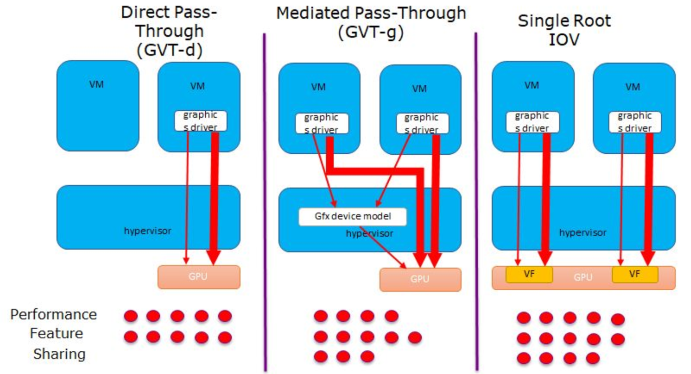

# Table of Contents
1. [Introduction](#introduction)
1. [Features Supported](#features-supported)
1. [Intel IoT Platforms Supported](#intel-iot-platforms-supported)
1. [Virtual Machine Device Model Supported](#virtual-machine-device-model-supported)
1. [Repository Layout and Naming Conventions](#repository-layout-and-naming-conventions)
1. [Host Setup](#host-setup)
    1. [GPU Passthrough Host Configuration](#gpu-passthrough-host-configuration)
    1. [Network SR-IOV Host Configuration](#network-sr-iov-host-configuration)
1. [Virtual Machine Image Creation](#virtual-machine-image-creation)
    1. [Ubuntu/Ubuntu RT VM Image Creation](#ubuntuubuntu-rt-vm-image-creation)
    1. [Windows VM Image Creation](#windows-vm-image-creation)
    1. [Android VM Image Creation](#android-vm-image-creation)
1. [VM Definition](#vm-definition)
1. [VM Management](#vm-management)
    1. [VM vCPU Allocation](#vm-vcpu-allocation)
    1. [VM Memory Allocation](#vm-memory-allocation)
    1. [VM Launch](#vm-launch)
    1. [VM Misc Operations](#vm-misc-operations)
    1. [VM Usage with Remote Desktop Viewer](#vm-usage-with-remote-desktop-viewer)
    1. [VM Power Management](#vm-power-management)
    1. [Automatic VM Power Management During Host Power Management](#automatic-vm-power-management-during-host-power-management)
    1. [VM Cloning](#vm-cloning)
    1. [VM Snapshots](#vm-snapshots)

# Introduction
This document contains setup and user guides for KVM (Kernel-based Virtual Machine) MultiOS Portfolio release.

KVM MultiOS Portfolio release provides configuration, setup and user guides for running virtual machines(VM) on Intel IoT platforms using [libvirt toolkit](https://libvirt.org/) on [KVM/QEMU](https://libvirt.org/drvqemu.html) hypervisor/emulator.

Intel IoT platform has a portfolio of graphics virtualization technologies trademarked as [Intel® Graphics Virtualization Technology™ (Intel GVT)](https://www.intel.com/content/www/us/en/virtualization/virtualization-technology/intel-virtualization-technology.html) for accelerating virtual machine workloads with GPU.
These virtualization technologies are accomplished using Intel’s foundational hardware virtualization features like [Intel® Virtualization Technology for Directed I/O (VT-d)](https://cdrdv2.intel.com/v1/dl/getContent/671081)

The different graphics virtualization technologies are:
- GVT-d or commonly known as ‘Direct Graphics Adaptor’ (vDGA) which is full device passthrough
- GVT-g which provides mediated device passthrough for Intel integrated GPUs (Broadwell till 10th generation Core processors)
- Single Root I/O Virtualization or SR-IOV which is a PCI-SIG standard  and supported by Intel integrated GPUs for 12th generation Core processors and beyond.

The below diagram shows comparision of different GPU graphics virtualization technology.


KVM MultiOS Portfolio release is targeted for newer Intel Core processors 12th gen and beyond hence GVT-g is not supported.

This documentation uses "domain" to refer to a guest virtual machine's unique name as per libvirt convention.

# Features Supported
- All VMs suspend/hibernate/resume for running VMs via single command.(Ubuntu/Windows only)
- Automatic suspend/hibernate/resume of running guest VMs during host suspend/hibernate/resume.(Ubuntu/Windows only)
- 1 step host platform configuration for running guest VMs with GVT-d or SR-IOV for GPU virtualization in guest VM.
- Automated installation process for generating guest VM image with built-in Intel GPU SR-IOV and power management support for:
    - Ubuntu 24.04
    - Windows 10 IoT Enterprise LTSC 21H2
    - Windows 11 IoT Enterprise 24H2
    - Android CiV from Celadon Project *
- Launching multiple VMs with SR-IOV Multi-Display support in Guest VM GPU/display virtualization and device passthrough configuration via single command.
- Cloning of VMs with SR-IOV Multi-Display support enabled.
- Launching multiple VMs using SPICE with GStreamer acceleration via SR-IOV support.
- Qemu hardware cursor feature enabled.

Note:
* The KVM MultiOS Portfolio release provides only limited support for Android CiV guests.
  It is intended solely for demonstration purposes and is not validated.
  Users are encouraged to collaborate with ISV/OSV partners to evaluate and develop the solution using a reference Base Release from the Celadon Project.
  For more information, please visit:
  * [Celadon Ecosystem](https://www.intel.com/content/www/us/en/developer/topic-technology/open/celadon/ecosystem.html)
  * [Celadon Base Releases](https://projectceladon.github.io/celadon-documentation/release-notes/base-releases.html)

# Intel IoT Platforms Supported
| Supported Intel IoT platform | Detailed Name |
| :-- | :--
| PTL-H | Panther Lake H |
| BTL | Bartlett Lake |
| TWL | Twin Lake |
| ARL | Arrow Lake |
| ASL | Amston Lake |
| MTL | Meteor Lake |
| RPL-PS | Raptor Lake PS |
| RPL-P | Raptor Lake P |
| ADL-N | Alder Lake N |

Note:
- Please contact your Intel representative for details on host IoT platform configuration and setup.
- Each hardware platform may support different default combination of guest OS domains.

# Virtual Machine Device Model Supported
KVM MultiOS Portfolio release provides easy configuration and setup for device virtualization/pass through to virtual machines.

Refer to [here](device_model.md) for details on the support device model for each VM.

# Repository Layout and Naming Conventions
KVM MultiOS Portfolio release is laid out as summarised below.
<table>
    <tr><th align="center">Location</th><th>Description</th></tr>
    <tr><td>documentation</td><td>KVM MultiOS Portfolio user guide and support documentation</td></tr>
    <tr><td>guest_setup</td><td>Guest VM image creation scripts for supported guest operating system</td></tr>
    <tr><td>host_setup</td><td>Host setup scripts for supported host operating system</td></tr>
    <tr><td>libvirt_scripts</td><td>Host scripts using libvirt toolkit for ease of use</td></tr>
    <tr><td>platform/&ltplatform_name&gt/libvirt_xml</td><td> Intel IoT hardware platform supported VM definition xmls</td></tr>
</table>

## Host OS Naming Convention
| Host Operating System | name used KVM MultiOS Portfolio Release |
| :-- | :-- |
| Ubuntu | ubuntu |
| Redhat | redhat |

## Platform Naming Convention
| Supported Intel IoT platform | Platform name to use with KVM MultiOS Portfolio Release
| :-- | :-- |
| Panther Lake H | client
| Bartlett Lake | client
| Twin Lake | client
| Arrow Lake | client
| Amston Lake | client
| Meteor Lake | client
| Raptor Lake PS | client
| Raptor Lake P | client
| Alder Lake N | client

## Guest OS Domain Naming Convention, MAC/IP Address and Ports
***Notes***
- VM IP is corresponding default VM MAC address as defined in VM definition XML files provided in this release when used with launch_multios.sh helper script VM launch.
- Host is accessible to guest VMs launched in host via 192.168.122.1

| VM Operating System | Domain name | MAC address | IP address | VNC port | SPICE port |
| :-- | :-- | :-- | :-- | :-- | :-- |
| Ubuntu | ubuntu | 52:54:00:ab:cd:11 | 192.168.122.11 | 5901 | 5951 |
| Windows 10 | windows | 52:54:00:ab:cd:22 | 192.168.122.22 | 5902 | 5952 |
| Android | android | 52:54:00:ab:cd:33 | 192.168.122.33 | - | - |
| Ubuntu RT | ubuntu_rt | 52:54:00:ab:cd:44 | 192.168.122.44 | - | - |
| Windows 11 | windows11 | 52:54:00:ab:cd:55 | 192.168.122.55 | 5905 | 5955 |
| Redhat | redhat | 52:54:00:ab:cd:33 | 192.168.122.33 | 5903 | 5953 |
| CentOS | centos | 52:54:00:ab:cd:44 | 192.168.122.44 | 5904 | 5954 |

## Guest OS libvirt Domain XML Naming Convention
| XML filename | VM Operating System | display | GPU virtualization | OS boot (BIOS/UEFI) | default used in launch_multios.sh |
| :-- | :-- | :-- | :-- | :-- | :-- |
| ubuntu_vnc_spice.xml | Ubuntu | VNC/SPICE | None | UEFI | Yes |
| ubuntu_spice-gst.xml | Ubuntu | SPICE with gstreamer integration | SR-IOV | UEFI | Yes |
| ubuntu_gvtd.xml | Ubuntu | Local Display | GVT-d in legacy mode | UEFI | Yes |
| ubuntu_sriov.xml | Ubuntu | Local Display | SR-IOV | UEFI | Yes |
| ubuntu_rt_headless.xml | Ubuntu RT | Headless | None | UEFI | Yes |
| windows_vnc_spice_ovmf.xml | Windows 10 | VNC/SPICE | None | UEFI | Yes |
| windows_spice-gst_ovmf.xml | Windows 10 | SPICE with gstreamer integration | SR-IOV | UEFI | Yes |
| windows_gvtd_ovmf.xml | Windows 10 | Local Display | GVT-d in legacy mode| UEFI | Yes |
| windows_gvtd_upt_ovmf.xml | Windows 10 | VNC | GVT-d in UPT mode | UEFI | No |
| windows_sriov_ovmf.xml | Windows 10 | Local Display | SR-IOV | UEFI | Yes |
| android_virtio-gpu.xml | Android | Local Display | Virtio-GPU | UEFI | Yes |
| android_gvtd.xml | Android | Local Display | GVT-d in legacy mode | UEFI | Yes |
| android_sriov.xml | Android | Local Display | SR-IOV | UEFI | Yes |
| centos_vnc_spice.xml | CentOS | VNC/SPICE | None | UEFI | Yes |
| redhat_vnc_spice.xml | Redhat | VNC/SPICE | None | UEFI | Yes |
| windows11_vnc_spice_ovmf.xml | Windows 11 | VNC/SPICE | None | UEFI | Yes |
| windows11_spice-gst_ovmf.xml | Windows 11 | SPICE with gstreamer integration | SR-IOV | UEFI | Yes |
| windows11_gvtd_ovmf.xml | Windows 11 | Local Display | GVT-d in legacy mode| UEFI | Yes |
| windows11_gvtd_upt_ovmf.xml | Windows 11 | VNC | GVT-d in UPT mode | UEFI | No |
| windows11_sriov_ovmf.xml | Windows 11 | Local Display | SR-IOV | UEFI | Yes |

# Host Setup
Before running virtual machines on an Intel IoT platform, the host system must be configured to enable hardware acceleration for graphics and networking (depending on the specific hardware support). This section provides guidance for setting up GPU virtualization and network acceleration features using straightforward automated scripts.

Each configuration requires running the host setup script (`setup_host.sh`) with the appropriate parameters for the chosen GPU virtualization mode. The setup process will configure necessary kernel parameters, install required packages, and reboot the system. Refer to the linked setup guides below for detailed step-by-step instructions, BIOS requirements, and prerequisites.

Once configured, the host will be ready to run multiple virtual machines with excellent performance, based on the platform's capabilities.

## GPU Passthrough Host Configuration
The host platform supports two mutually exclusive GPU passthrough technologies for providing graphics acceleration to virtual machines:

- **GPU SR-IOV (Single Root I/O Virtualization)**
- **GVT-d (Graphics Virtualization Technology - direct)**

The recommended method is to use **GPU SR-IOV**, which enables the GPU to be partitioned into multiple Virtual Functions (VFs), allowing multiple VMs to share the same physical GPU simultaneously with hardware-accelerated graphics. This technology provides efficient resource utilization by enabling concurrent GPU access across multiple virtual machines. For GPU SR-IOV setup instructions, see [setup_sriov.md](setup_sriov.md).

As an alternative, **GVT-d** provides full device passthrough where the entire GPU is dedicated to a single virtual machine. This approach offers native performance since the VM has direct, exclusive access to the GPU hardware. However, this limits GPU usage to one VM at a time, as the physical device cannot be shared. This method is suitable for scenarios requiring dedicated GPU access. For GVT-d setup instructions, see [setup_gvtd.md](setup_gvtd.md).

**Note:** Either GPU SR-IOV or GVT-d must be chosen during host setup. The two modes cannot be used simultaneously on the same system.

## Network SR-IOV Host Configuration
Network SR-IOV (Single Root I/O Virtualization) enables network interface cards to be virtualized at the hardware level, allowing multiple virtual machines to share a single physical NIC while maintaining near-native network performance. SR-IOV partitions a physical network adapter into multiple Virtual Functions (VFs), where each VF can be directly assigned to a guest VM, bypassing the hypervisor's virtual network stack. This results in enhanced network throughput, reduced latency, and lower CPU overhead compared to traditional software-based network virtualization.

For systems with SR-IOV capable NICs, virtual network functions can be configured to provide network acceleration to virtual machines. Refer to [setup_network.md](setup_network.md) for detailed configuration instructions.

**Note:** Network SR-IOV is independent of GPU passthrough and can be used with either GVT-d or GPU SR-IOV configurations.

# Virtual Machine Image Creation
This section is a guide on how to install and configure the different operating systems supported for using them as virtual machine images on the supported Intel platforms, for the supported feature set.

## Ubuntu/Ubuntu RT VM Image Creation
Refer [here](ubuntu_vm.md#automated-ubuntuubuntu-rt-vm-installation) for steps on creating Ubuntu/Ubuntu RT VM image for using GPU virtualization technologies for Intel IoT platforms.

## Windows VM Image Creation 
Refer [here](windows_vm.md#automated-windows-vm-installation) for steps on creating Window VM image for using GPU virtualization technologies for Intel IoT platforms.

## Android VM Image Creation
Refer [here](android_vm.md#android-vm-auto-installation) for steps on creating Android VM image for using GPU virtualization technologies for Intel IoT platforms.

# VM Definition
KVM MultiOS Portfolio release provides default VM configurations for supported guest operating system and GPU/display virtualization desired as per libvirt XML schema.
Refer to [xml naming convention](#guest-os-libvirt-domain-xml-naming-convention) for XML file naming used.

If using a precreated VM image for Ubuntu/Windows instead of VM image creation as supported by release, please ensure VM image is named and located in the path as expected per defined in XML file <disk\>/\<source\> XML element. For example,
```
        <disk type="file" device="disk">
          ...
          <source file="/var/lib/libvirt/images/vm.qcow2"/>
          ...
        </disk>
```
Refer to [libvirt](https://libvirt.org/) for details on libvirt XML schema.

# VM Management
KVM MultiOS Portfolio release provides some ease of use scripts for managing one/many guest VMs such as:
- launch one or more guest VM domain with desired device passthrough to each VM domain.
- suspend/hibernate/resume all running guest VM domains (Ubuntu/Windows only).

Standard libvirt virsh command options could also be used with each domain after start.

** Note: Ensure that host platform has been correctly configured for KVM MultiOS Portfolio as per [Host Setup](#host-setup) and guest VMs used are also installed/configured as per [Virtual Machine Image Creation](#virtual-machine-image-creation) before running any commands in this section.**

## VM vCPU Allocation
The default VM vCPU allocation could be changed permanently by modifying VM definition xml file to take effect on next launch of VM.

### VM vCPU Allocation Change in XML Definition
To do so, identify the XML file of the VM to be modified. Refer to [Guest OS libvirt Domain XML Naming Convention](#guest-os-libvirt-domain-xml-naming-convention)
The XML file could then be found at ./platform/\<platform_name\>/xxxx.xml where xxxx is the identified XML filename and \<platform_name\> is as per [Platform Naming Convention](#platform-naming-convention) for the host platform.

The number of vCPUs allocated to VM could be found in the \<vcpu\> element of XML file which could be modified accordingly to desired values.

For example, the below shows 2 vCPU allocation for windows 10 guest VM.

        <name>windows</name>
        ...
        <vcpu>2</vcpu>
        ...

Reference: [Libvirt Domain XML format: CPU allocation](https://libvirt.org/formatdomain.html#cpu-allocation)

## VM Memory Allocation
The default VM memory size could be changed permanently by modifying VM definition xml file to take effect on next launch of VM.

### VM Memory Allocation Change in XML Definition
To do so, identify the XML file of the VM to be modified. Refer to [Guest OS libvirt Domain XML Naming Convention](#guest-os-libvirt-domain-xml-naming-convention)
The XML file could then be found at ./platform/\<platform_name\>/xxxx.xml where xxxx is the identified XML filename and \<platform_name\> is as per [Platform Naming Convention](#platform-naming-convention) for the host platform.

The memory allocated to VM could be found in the \<memory\> and \<currentMemory\> elements of XML file which could be modified accordingly to desired values. The unit is default to "KiB" for kibibytes (1024 bytes) unless otherwise specified.

For example, the below shows 4GB allocation for windows 10 guest VM.

        <name>windows</name>
        ...
        <memory>4194304</memory>
        <currentMemory>4194304</currentMemory>
        ...

Reference: [Libvirt Domain XML format: Memory allocation](https://libvirt.org/formatdomain.html#memory-allocation)

## VM Launch
To Launch one or more guest VM domain(s) and passthrough device(s) with libvirt toolkit on xxxx platform.
**Note: refer to [Guest OS domain naming convention](#guest-os-domain-naming-convention) for domain

        ./platform/xxxx/launch_multios.sh [-h|--help] [-f] [-a] [-d domain1 <domain2> ...] [-g <headless|vnc|spice|spice-gst|sriov|gvtd> domain1 <domain2> ...] [ -n <sriov|network_name> domain1 <domain2> ...] [-p domain --usb|--pci device <number> | -p <domain> --tpm <type> (<model>) | -p domain --xml file] [-m domain --output <number> |--connectors display port | --full-screen | --show-fps | --extend-abs-mode | --disable-host-input]

### Launch_multios Script Options
<table>
    <tr><th colspan="2" align="center">Option</th><th>Description</th></tr>
    <tr><td>-h, --help</td><td></td><td>Show the help message and exit</td></tr>
    <tr><td>-f</td><td></td><td>Force shutdown, destory and start VM domain(s) even if already running</td></tr>
    <tr><td>-a</td><td></td><td>Launch all supported VM domains for platform</td></tr>
    <tr><td>-d</td><td>&ltdomain&gt...&ltdomainN&gt</td><td>Name of all VM domain(s) to launch. Superset of domain(s) used with -p|-g options.</td></tr>
    <tr><td rowspan="6">-g</td><td>headless &ltdomain&gt...&ltdomainN&gt</td><td>Headless for VM domains of names &ltdomain&gt...&ltdomainN&gt</td></tr>
    <tr><td>vnc &ltdomain&gt...&ltdomainN&gt</td><td>Use VNC for VM domains of names &ltdomain&gt...&ltdomainN&gt</td></tr>
    <tr><td>spice &ltdomain&gt...&ltdomainN&gt</td><td>Use SPICE for VM domains of names &ltdomain&gt...&ltdomainN&gt</td></tr>
    <tr><td>spice-gst &ltdomain&gt...&ltdomainN&gt</td><td>Use SPICE with gstreamer integration for VM domains of names &ltdomain&gt...&ltdomainN&gt</td></tr>
    <tr><td>sriov &ltdomain&gt...&ltdomainN&gt</td><td>Use SR-IOV for VM domains of names &ltdomain&gt...&ltdomainN&gt. Superset of domain(s) used with -m option.</td></tr>
    <tr><td>gvtd &ltdomain&gt</td><td>Use GVT-d for VM domain</td></tr>
    <tr><td rowspan="2">-n</td><td>sriov &ltdomain&gt...&ltdomainN&gt</td><td>Auto-select an available SR-IOV pool for &ltdomain&gt...&ltdomainN&gt</td></tr>
    <tr><td>&ltnetwork name&gt &ltdomain&gt...&ltdomainN&gt</td><td> <network_name> Select a network from 'virsh net-list --name' for &ltdomain&gt...&ltdomainN&gt</td></tr>
    <tr><td rowspan="5">-p</td><td>&ltdomain&gt --usb &ltdevice_type&gt [N]</td><td>Passthrough Nth USB device in host of type &ltdevice_type&gt in description to VM of name &ltdomain&gt</td></tr>
    <tr><td>&ltdomain&gt --usbtree &lttree&gt [N]</td><td>Passthrough Nth USB bus device tree in host of topology &lttree&gt in description to VM of name &ltdomain&gt</td></tr>
    <tr><td>&ltdomain&gt --pci &ltdevice_type&gt [N]</td><td>Passthrough Nth PCI device in host of type &ltdevice_type&gt in description to VM of name &ltdomain&gt</td></tr>
    <tr><td>&ltdomain&gt --tpm &lttype&gt &ltmodel&gt</td><td>Passthrough TPM device in host with backend type &lttype&gt and &ltmodel&gt in description to VM of name &ltdomain&gt. Note: not supported on Android VM in this release</td></tr>
    <tr><td>&ltdomain&gt --xml &ltfile&gt</td><td>Passthrough device(s) in &ltfile&gt according to libvirt Domain XML format to VM of name &ltdomain&gt</td></tr>
    <tr><td rowspan="6">-m</td><td>&ltdomain&gt --output &ltN&gt</td><td>Specify the number of guest displays N (range: 1-4) assigned to the &ltdomain&gt. The --connectors option must be specified together.</td></tr>
    <tr><td>&ltdomain&gt --connectors &ltdisplay_port&gt </td><td>Specify the display connector assigned to the &ltdomain&gt. </br>Refer to the note below on retrieving the names of the display ports. </br>Also refer to the examples below for detailed usage of &ltdisplay_port&gt.</td></tr>
    <tr><td>&ltdomain&gt --full-screen</td><td>Enable full-screen mode for the &ltdomain&gt</td></tr>
    <tr><td>&ltdomain&gt --show-fps</td><td>Show the fps info on the guest VM primary display</td></tr>
    <tr><td>&ltdomain&gt --extend-abs-mode</td><td>Enable extend absolute mode across all monitors</td></tr>
    <tr><td>&ltdomain&gt --disable-host-input</td><td>Disable host's HID devices to control the monitors</td></tr>
</table>

**Note:**
</br>Use the command below to retrieve the names of the display port connections on a host hardware board.
</br>Take note of the connections that have actual physical displays **connected**.

        $ DISPLAY=:0 xrandr --query
        Screen 0: minimum 320 x 200, current 1280 x 1024, maximum 16384 x 16384
        DP-1 connected primary 1280x1024+0+0 (normal left inverted right x axis y axis) 450mm x 360mm
           1280x1024     60.02 +  75.02*
           1152x864      75.00    59.97
           1024x768      85.00    75.03    70.07    60.00
           800x600       85.06    72.19    75.00    60.32    56.25
           640x480       85.01    75.00    72.81    59.94
           720x400       70.08
        HDMI-1 connected 1280x1024+0+0 (normal left inverted right x axis y axis) 480mm x 270mm
           1920x1080     60.00 +  59.94
           1920x1200     59.95
           1680x1050     59.88
           1600x900      60.00
           1280x1024     75.02*   60.02
           1440x900      59.90
           1280x800      59.91
           1152x864      75.00
           1280x720      60.00    59.94
           1024x768      75.03    70.07    60.00
           800x600       72.19    75.00    60.32    56.25
           640x480       75.00    72.81    60.00    59.94
        DP-2 disconnected (normal left inverted right x axis y axis)
        HDMI-2 disconnected (normal left inverted right x axis y axis)
        DP-3 disconnected (normal left inverted right x axis y axis)
        HDMI-3 disconnected (normal left inverted right x axis y axis)
        DP-4 disconnected (normal left inverted right x axis y axis)
        HDMI-4 disconnected (normal left inverted right x axis y axis)
        DP-5 disconnected (normal left inverted right x axis y axis)
        DP-6 disconnected (normal left inverted right x axis y axis)

For this sample output, the connected displays are at DP-1 and HDMI-1.
</br> The acceptable values that can be used for \<display_port\> are DP-1 and HDMI-1.

### Examples
<table>
    <tr><th align="center">Example</th><th>Description</th></tr>
    <tr><td rowspan="1">./platform/xxxx/launch_multios.sh -a</td><td>To launch all guest VMs with default configuration</td></tr>
    <tr><td rowspan="1">./platform/xxxx/launch_multios.sh -f -a</td><td>To force launch all guest VMs with default configuration even if VMs are already running</td></tr>
    <tr><td rowspan="1">./platform/xxxx/launch_multios.sh -d ubuntu</td><td>To launch ubuntu guest VM</td></tr>
    <tr><td rowspan="1">./platform/xxxx/launch_multios.sh -f -d ubuntu</td><td>To force launch ubuntu guest VM</td></tr>
    <tr><td rowspan="1">./platform/xxxx/launch_multios.sh -f -d ubuntu -g gvtd ubuntu</td><td>To force launch ubuntu guest VM configured with GVT-d display</td></tr>
    <tr><td rowspan="1">./platform/xxxx/launch_multios.sh -f -d windows -g gvtd windows</td><td>To force launch windows guest VM configured with GVT-d display</td></tr>
    <tr><td rowspan="1">./platform/xxxx/launch_multios.sh -f -d ubuntu -g vnc ubuntu</td><td>To force launch ubuntu guest VM with VNC display</td></tr>
    <tr><td rowspan="1">./platform/xxxx/launch_multios.sh -f -d windows -g vnc windows</td><td>To force launch windows guest VM with VNC display</td></tr>
    <tr><td rowspan="1">./platform/xxxx/launch_multios.sh -f -d ubuntu -g spice ubuntu</td><td>To force launch ubuntu guest VM with SPICE display</td></tr>
    <tr><td rowspan="1">./platform/xxxx/launch_multios.sh -f -d windows -g spice windows</td><td>To force launch windows guest VM with SPICE display</td></tr>
    <tr><td rowspan="1">./platform/xxxx/launch_multios.sh -f -d ubuntu -g spice-gst ubuntu</td><td>To force launch ubuntu guest VM with SPICE-GST (SPICE with GStreamer acceleration) display</td></tr>
    <tr><td rowspan="1">./platform/xxxx/launch_multios.sh -f -d windows -g spice-gst windows</td><td>To force launch windows guest VM with SPICE-GST (SPICE with GStreamer acceleration) display</td></tr>
    <tr><td rowspan="1">./platform/xxxx/launch_multios.sh -f -d windows -g sriov windows</td><td>To force launch windows 10 guest VM configured with SR-IOV display</td></tr>
    <tr><td rowspan="1">./platform/xxxx/launch_multios.sh -f -a -g sriov ubuntu windows</td><td>To force launch all guest VMs, ubuntu and windows 10 guest VM configured with SR-IOV display</td></tr>
    <tr><td rowspan="1">./platform/xxxx/launch_multios.sh -f -d ubuntu -n sriov ubuntu</td><td>To force launch ubuntu guest VM configured with SR-IOV network (if supported by NIC)</td></tr>
    <tr><td rowspan="1">./platform/xxxx/launch_multios.sh -f -d windows -n &ltnetwork_name&gt windows</td><td>To force launch windows 10 guest VM configured with a network from 'virsh net-list --name'</td></tr>
    <tr><td rowspan="1">./platform/xxxx/launch_multios.sh -f -d ubuntu windows -n sriov ubuntu windows</td><td>To force launch Ubuntu and Windows guest VMs both configured with SR-IOV network (if supported by NIC)</td></tr>
    <tr><td rowspan="1">./platform/xxxx/launch_multios.sh -f -d ubuntu windows windows11 -n &ltnetwork_name&gt ubuntu windows -n sriov windows11</td><td>To force launch multiple guest VMs with Ubuntu and Windows 10 configured with a custom network, and Windows 11 configured with SR-IOV network</td></tr>
    <tr><td rowspan="1">./platform/xxxx/launch_multios.sh -f -a -n sriov ubuntu windows -n &ltnetwork_name&gt windows11</td><td>To force launch all guest VMs, with Ubuntu and Windows 10 configured with SR-IOV network, and Windows 11 configured with a network from 'virsh net-list --name'</td></tr>
    <tr><td rowspan="1">./platform/xxxx/launch_multios.sh -f -a -p ubuntu --usb keyboard</td><td>To force launch all guest VMs and passthrough USB Keyboard to ubuntu guest VM</td></tr>
    <tr><td rowspan="1">./platform/xxxx/launch_multios.sh -f -a -p ubuntu --usbtree bus-port_L1.port_L2...port_Lx </td><td>To force launch all guest VMs and passthrough USB devices to guest VM, using USB tree topology containing the bus and port numbers (see section below).</td></tr>
    <tr><td rowspan="1">./platform/xxxx/launch_multios.sh -f -a -p ubuntu --pci wi-fi</td><td>To force launch all guest VMs and passthrough PCI WiFi to ubuntu guest VM</td></tr>
    <tr><td rowspan="1">./platform/xxxx/launch_multios.sh -f -a -p ubuntu --pci network controller 2</td><td>To force launch all guest VMs and passthrough the 2nd PCI Network Controller in lspci list to ubuntu guest VM</td></tr>
    <tr><td rowspan="1">./platform/xxxx/launch_multios.sh -f -a -p ubuntu --tpm passthrough crb</td><td>To force launch all guest VMs and passthrough TPM with crb model to ubuntu guest VM</td></tr>
    <tr><td rowspan="1">./platform/xxxx/launch_multios.sh -f -a -p ubuntu --xml xxxx.xml</td><td>To force launch all guest VMs and passthrough the device(s) in the XML file to ubuntu guest VM</td></tr>
    <tr><td rowspan="1">./platform/xxxx/launch_multios.sh -f -a -p ubuntu --usb keyboard -p windows --pci wi-fi -p ubuntu --xml xxxx.xml</td><td>To force launch all guest VMs, passthrough USB Keyboard to ubuntu guest VM, passthrough PCI WiFi to windows 10 guest VM, and passthrough device(s) in the XML file to ubuntu guest VM</td></tr>
    <tr><td rowspan="1">./platform/xxxx/launch_multios.sh -f -a -p ubuntu --usb keyboard --usb ethernet -p windows --usb mouse --pci wi-fi</td><td>To force launch all guest VMs, passthrough USB Keyboard, USB ethernet to ubuntu guest VM, passthrough USB Mouse and PCI WiFi to windows 10 guest VM</td></tr>
    <tr><td rowspan="1">./platform/xxxx/launch_multios.sh -f -a -p ubuntu --usb keyboard --usb ethernet --tpm passthrough crb -p windows --usb mouse --pci wi-fi</td><td>To force launch all guest VMs, passthrough USB Keyboard, USB ethernet and TPM device to ubuntu guest VM, passthrough USB Mouse and PCI WiFi to windows 10 guest VM</td></tr>
    <tr><td rowspan="1">./platform/xxxx/launch_multios.sh -d windows -g sriov windows -m windows --connectors DP-1</td><td>To launch windows 10 guest VM with SR-IOV graphics on DP-1 physical display</td></tr>
    <tr><td rowspan="1">./platform/xxxx/launch_multios.sh -d windows -g sriov windows -m windows --connectors DP-1 -full-screen</td><td>To launch windows 10 guest VM with SR-IOV graphics on DP-1 physical display in full screen mode</td></tr>
    <tr><td rowspan="1">./platform/xxxx/launch_multios.sh -d windows -g sriov windows -m windows --output 2 --connectors DP-1,DP-1 </td><td>To launch windows 10 guest VM with 2 guest display windows on a single DP-1 physical display</td></tr>
    <tr><td rowspan="1">./platform/xxxx/launch_multios.sh -d windows -g sriov windows -m windows --output 2 --connectors DP-1,HDMI-1 --full-screen</td><td>To launch windows 10 guest VM with 2 guest displays in full-screen mode on HDMI-1 and DP-1 physical displays</td></tr>
    <tr><td rowspan="1">./platform/xxxx/launch_multios.sh -d ubuntu windows -g sriov ubuntu windows -m ubuntu --connectors DP-1 -m windows --connectors HDMI-1 </td><td>To launch ubuntu and windows 10 guest VMs with ubuntu guest display window on DP-1 physical display and windows guest display window on HDMI-1 physical display</td></tr>
    <tr><td rowspan="1">./platform/xxxx/launch_multios.sh -d windows11 -f -g sriov windows11</td><td>To force launch windows 11 guest VM configured with SR-IOV display</td></tr>
    <tr><td rowspan="1">./platform/xxxx/launch_multios.sh -d windows11 -f -g gvtd windows11</td><td>To force launch windows 11 guest VM configured with GVT-d display</td></tr>
</table>

### VM Launch with USB Passthrough Using "--usbtree" Option
To passthrough using the "--usbtree" option, the first step is to identify the respective USB bus and port numbers associated with the targeted USB devices, using the commands "lsusb" and "lsusb -t"

For example, to passthrough keyboards to the various guests, use lsusb to identify the keyboard devices as shown below.

        $ lsusb | grep -i keyboard
                Bus 003 Device 007: ID 046d:c31c Logitech, Inc. Keyboard K120
                Bus 003 Device 019: ID 03f0:034a HP, Inc Elite Keyboard
                Bus 003 Device 021: ID 413c:2003 Dell Computer Corp. Keyboard SK-8115


Next, run "lsusb -t" to list out the USB tree, and identify the bus and port numbers for the keyboards.


        $ lsusb -t
                /:  Bus 001.Port 001: Dev 001, Class=root_hub, Driver=xhci_hcd/1p, 480M
                /:  Bus 002.Port 001: Dev 001, Class=root_hub, Driver=xhci_hcd/2p, 20000M/x2
                /:  Bus 003.Port 001: Dev 001, Class=root_hub, Driver=xhci_hcd/16p, 480M
                    |__ Port 002: Dev 020, If 0, Class=Hub, Driver=hub/4p, 480M
                        |__ Port 001: Dev 021, If 0, Class=Human Interface Device, Driver=usbhid, 1.5M
                        |__ Port 002: Dev 022, If 0, Class=Human Interface Device, Driver=usbhid, 1.5M
                    |__ Port 003: Dev 011, If 0, Class=Human Interface Device, Driver=usbhid, 1.5M
                    |__ Port 003: Dev 011, If 1, Class=Human Interface Device, Driver=usbhid, 1.5M
                    |__ Port 003: Dev 011, If 2, Class=Human Interface Device, Driver=usbhid, 1.5M
                    |__ Port 004: Dev 018, If 0, Class=Hub, Driver=hub/4p, 480M
                        |__ Port 004: Dev 019, If 0, Class=Human Interface Device, Driver=usbhid, 1.5M
                        |__ Port 004: Dev 019, If 1, Class=Human Interface Device, Driver=usbhid, 1.5M
                    |__ Port 008: Dev 005, If 0, Class=Communications, Driver=cdc_ether, 480M
                    |__ Port 008: Dev 005, If 1, Class=CDC Data, Driver=cdc_ether, 480M
                    |__ Port 010: Dev 006, If 0, Class=Video, Driver=uvcvideo, 480M
                    |__ Port 010: Dev 006, If 1, Class=Video, Driver=uvcvideo, 480M
                    |__ Port 010: Dev 006, If 2, Class=Audio, Driver=snd-usb-audio, 480M
                    |__ Port 010: Dev 006, If 3, Class=Audio, Driver=snd-usb-audio, 480M
                    |__ Port 012: Dev 007, If 0, Class=Human Interface Device, Driver=usbhid, 1.5M
                    |__ Port 012: Dev 007, If 1, Class=Human Interface Device, Driver=usbhid, 1.5M
                    |__ Port 014: Dev 008, If 0, Class=Wireless, Driver=btusb, 12M
                    |__ Port 014: Dev 008, If 1, Class=Wireless, Driver=btusb, 12M
                /:  Bus 004.Port 001: Dev 001, Class=root_hub, Driver=xhci_hcd/8p, 20000M/x2
                    |__ Port 004: Dev 002, If 0, Class=Mass Storage, Driver=uas, 5000M


From the example, the respective bus and port numbers are:

- Dev 007: bus 3 -> port 12
- Dev 019: bus 3 -> port 4 -> port 4
- Dev 021: bus 3 -> port 2 -> port 1

Note: Dev 011 is a HID but it is not a keyboard.

Lastly, to start guest VMs and passthrough the keyboards to the various guest VMs, use the following sample commands.

            # Dev 007
            $ ./platform/client/launch_multios.sh -f -d windows11 -g sriov windows11 -p windows11 --usbtree 3-12

            # Dev 019
            $ ./platform/client/launch_multios.sh -f -d windows -g sriov windows -p windows --usbtree 3-4.4

            # Dev 021
            $ ./platform/client/launch_multios.sh -f -d ubuntu -g sriov ubuntu -p ubuntu --usbtree 3-2.1

## VM Misc Operations
| libvirt command | Operation |
| :-- | :-- |
| virsh list | list running domains |
| virsh list --all | list all domains (including running) |
| virsh domifaddr \<domain\> | Get domain network info |
| virsh domdisplay --type vnc \<domain\> | Get domain vnc port info |
| virsh domdisplay --type spice \<domain\> | Get domain spice port info |
| virsh console \<domain\>| Attach to VM virtual serial console (if available, such as on Ubuntu) |
| virsh shutdown \<domain\>| Trigger VM to shutdown |
| virsh destroy \<domain\>| Force kill VM |
| virsh reboot \<domain\>| Run a reboot command in guest domain |

Use "virsh --help" for more help information or refer to [libvirt virsh manpage](https://www.libvirt.org/manpages/virsh.html) documentation for more commands.

## VM Usage with Remote Desktop Viewer

This section describes how to connect to running VMs using remote desktop viewers for VNC, SPICE, and SPICE-GST.

### Prerequisites

- A separate machine must be set up with Ubuntu BSP to run the remote viewer client. It should have the same Ubuntu BSP release as the Intel IoT platform host machine that is running the guest VMs.
- The virt-viewer package included in the Ubuntu BSP release provides the `remote-viewer` client needed for viewing remote desktops of running VMs over VNC and SPICE channels.

### Connecting via VNC

To connect to a VM using VNC:

1. Launch the VM with VNC display. For example:

        $ ./platform/client/launch_multios.sh -f -d <domain> -g vnc <domain>

2. Determine the VNC display assigned to the VM:

        $ virsh domdisplay --type vnc <domain>

   This will output something like `vnc://localhost:1`, where `:1` is the display number.

   To calculate the actual VNC port, add 5900 to the display number. For example:
   - Display `:0` = Port 5900
   - Display `:1` = Port 5901
   - Display `:2` = Port 5902

3. On the separate machine, use `remote-viewer` to connect:

        $ remote-viewer vnc://<ip_of_host_running_vm>:<vnc_port_of_vm>

   For example, if the display is `:1` and the host IP is 192.168.122.1, use:

        $ remote-viewer vnc://192.168.122.1:5901

### Connecting via SPICE

To connect to a VM using SPICE:

1. Launch the VM with SPICE display. For example:

        $ ./platform/client/launch_multios.sh -f -d <domain> -g spice <domain>

2. Determine the SPICE port assigned to the VM:

        $ virsh domdisplay --type spice <domain>

   This will output something like `spice://localhost:5951`, which directly shows the SPICE port number.

3. On the separate machine, use `remote-viewer` to connect:

        $ remote-viewer spice://<ip_of_host_running_vm>:<spice_port_of_vm>

   For example, if the host IP is 192.168.122.1 and the port is 5951, use:

        $ remote-viewer spice://192.168.122.1:5951

### Connecting via SPICE-GST

To connect to a VM using SPICE with GStreamer acceleration:

1. Launch the VM with SPICE-GST display. For example:

        $ ./platform/client/launch_multios.sh -f -d <domain> -g spice-gst <domain>

2. Determine the SPICE port assigned to the VM:

        $ virsh domdisplay --type spice <domain>

   This will output something like `spice://localhost:5951`, which directly shows the SPICE port number.

3. On the separate machine, use `remote-viewer` to connect:

        $ remote-viewer spice://<ip_of_host_running_vm>:<spice_port_of_vm>

   For example, if the host IP is 192.168.122.1 and the port is 5951, use:

        $ remote-viewer spice://192.168.122.1:5951

**Note:** For remote desktop viewing of VMs using SPICE with GStreamer acceleration feature, only Ubuntu-based remote viewer is supported.

### Troubleshooting

**Network Connectivity:**
- Ensure the separate machine running `remote-viewer` can reach the host machine's IP address. Connectivity can be tested using `ping <ip_of_host_running_vm>`.
- Replace `<ip_of_host_running_vm>` with the actual IP address of the host machine that is accessible from the separate machine (not `localhost` or `127.0.0.1`).
- To find the host's IP address, run `ip addr` or `hostname -I` on the host machine.

**Firewall Configuration:**
- Ensure the firewall on the host machine allows incoming connections on the VNC/SPICE ports.
- For VNC, the default ports are 5900-5910 (display :0 through :10).
- For SPICE, the default ports are 5951-5960.
- On Ubuntu hosts, these ports can be allowed using:
  ```
  $ sudo ufw allow 5900:5910/tcp  # For VNC
  $ sudo ufw allow 5951:5960/tcp  # For SPICE
  ```

## VM Power Management
KVM MultiOS Portfolio release provides an ease of use script (libvirt_scripts/libvirt-guests-sleep.sh) to suspend/hibernate/resume all running supported guest VM domains (Ubuntu/Windows only).

**Note: Windows VM only supports hibernate option**

        Usage:
        $ ./libvirt_scripts/libvirt-guests-sleep.sh --help
        libvirt-guests-sleep.sh [-h] [--suspend] [--hibernate] [--resume]
        Options:
                -h      show this help message
                --suspend       Suspend all running guests if supported.
                                If suspend-to-ram is not supported by guest, hibernation will be used instead.
                --hibernate     Hibernate all running guests if supported.
                --resume        Resume all currently suspended guests
                Note: Only guests of below OS type are supported:
                        Ubuntu
                        Microsoft Windows

A successfully suspended guest VM will be in "pmsuspended" state as shown by "virsh list" command.

         Id   Name      State
        -----------------------------
         XX   ubuntu    pmsuspended

Resume all suspend guest VMs by:

        Usage:
        $ ./libvirt_scripts/libvirt-guests-sleep.sh --resume

A successfully hibernated guest VM will be in "shut off" state as shown by "virsh list" command. Such guests will automatically resume from hibernated state when restarted using launch_multios.sh as per [VM Launch](#vm-launch)

         Id   Name      State
        -----------------------------
         XX   ubuntu    shut off

Individual guest VM domains could also be suspended/hibernated/resumed by below libvirt commands:
| libvirt command | Operation |
| :-- | :-- |
| virsh dompmsuspend --target mem \<domain\>| Suspend selected domain. Command fails if suspend not supported by domain|
| virsh dompmsuspend --target disk \<domain\>| Hibernate selected domain. Command fails if hibernation not supported by domain|
| virsh dompmwakeup \<domain\>| Resume selected domain in pmsuspended state|

## Automatic VM Power Management During Host Power Management
KVM MultiOS Portfolio release supports automatically triggering suspend/hibernate for running supported guest VM domains during host suspend/hibernate via host "systemctl suspend/hibernate" commands.

Once host suspend/hibernate is initiated via systemctl command, all running VM will be similarly suspended/hibernated prior to actual host suspend/hibernate.

Upon host wake up from suspend, all previously suspended VMs will be automatically resumed.

All successfully hibernated guest VM will be in "Shut off" state as shown by "virsh list" command. Such guests will automatically resume from hibernated state when restarted using launch_multios.sh as per [VM Launch](#vm-launch)

## VM Cloning
KVM MultiOS Portfolio release provides an easy-to-use script to clone guests from an existing domain or XML file.

### Prerequisites
The source guest image must be created before using the script, as described in the installation procedures for [Ubuntu](ubuntu_vm.md#automated-ubuntuubuntu-rt-vm-installation) and [Windows](windows_vm.md#automated-windows-vm-installation).

### Cloning Source Options
The script supports two methods for specifying the cloning source:
- `-s` option: Clone from an existing domain
- `-x` option: Clone from an XML template file

The `-s` (Existing Domain) option clones from an existing, defined domain on the system (visible in `virsh list --all`). The cloned VM will use a duplicate copy of the source domain's XML configuration and inherit the same graphics configuration (VNC, SPICE, SR-IOV, GVT-d, etc.). By default, the source domain's disk image is duplicated to create a new independent disk image for the cloned VM.

With the `-x` (XML Template) option, the script clones from an XML template file in the `platform/<platform>/libvirt_xml/` directory. This allows you to create a new VM with a specific graphics setup by selecting the appropriate XML file (e.g., `windows_sriov_ovmf.xml` for SR-IOV, `windows_vnc_spice_ovmf.xml` for VNC/SPICE). When used alone, the disk image referenced in the XML file must already exist. By default, it will be duplicated to create a new independent disk image for the cloned VM.

### Image Handling Options
The script provides several options for handling disk images during cloning:
- `--forceclean`: Removes both the domain and existing disk image if they exist, then creates new ones
- `--preserve_data`: Preserves an existing disk image if present, or creates a new one if not
- `--import_data`: Imports an existing qcow2 image file from an external location
- `--image_path`: Specifies a custom directory for storing the cloned VM image

The `--forceclean` option ensures a clean slate by removing both the domain definition and its associated disk image if they already exist before creating the new cloned VM. This is useful when you want to completely recreate a VM from scratch without any remnants of previous configurations. The `--preserve_data` option provides the opposite behavior by preserving an existing disk image if one is found at the target location, or creating a new one if no existing image is present. This is particularly useful for maintaining existing VM data while updating the domain configuration. Note that `--forceclean` and `--preserve_data` are mutually exclusive options.

The `--import_data` option allows importing an existing qcow2 image file when creating a new domain from an XML template (requires `-x`). The qcow2 file will be copied to the image storage location and named as `<new_domain>.qcow2`. This is useful for migrating existing VM images or creating domains from pre-configured disk images. This option requires the `-x` option and is mutually exclusive with `-s`. It cannot be combined with `--preserve_data` as the image is always copied from the source location.

The `--image_path` option allows storing the cloned VM image in a custom directory instead of the default `/var/lib/libvirt/images/` location. Either an absolute path (e.g., `/home/user/vm-images`) or a relative path (e.g., `./vm-images` or `~/vm-images`) can be specified, which will be automatically resolved to an absolute path. The script automatically creates the directory if it doesn't exist (with user confirmation) and sets up a libvirt storage pool for proper management. This is useful for organizing VMs in different storage locations, using separate disks/partitions for different VMs, or managing storage quotas. Multiple storage pools can coexist simultaneously, allowing VMs to be mixed between the default location and custom locations.

### iGPU SR-IOV VF Assignment
The script extends [virt-clone](http://man.docs.sk/1/virt-clone.html) functionality by supporting iGPU SR-IOV VF assignment for cloned guest domains. If an iGPU VF is assigned in the source domain or XML file, the script provides three options for VF assignment to the cloned domain:
- `--igpu_vf_auto` option: Automatic assignment
- `--igpu_vf` option: Manual assignment with validation
- `--igpu_vf_force` option: Forced manual assignment

The `--igpu_vf_auto` (Automatic Assignment) option enables the script to automatically search for an available VF starting from a specified VF number up to the maximum available VF. This option prevents conflicts by selecting only VFs that are not currently assigned to other domains. For example, `--igpu_vf_auto 4` will search for the first available VF starting from VF 4.

With `--igpu_vf` (Manual Assignment with Validation), you manually specify a VF number for the cloned domain. The script validates that the specified VF is not already assigned to an existing domain before proceeding with the assignment. If the VF is already in use, the cloning operation will fail with an error.

For `--igpu_vf_force` (Forced Manual Assignment), you manually specify a VF number without checking if it's already assigned to other domains. Use this option with caution as it may result in VF conflicts if multiple domains attempt to use the same VF simultaneously.

### VNC and SPICE Port Assignment
For cloned domains that use VNC or SPICE display, `virt-clone` automatically sets the port to -1 (auto) to enable automatic port assignment by libvirt. This prevents port conflicts between the source and cloned domains. To verify the assigned port number for a cloned domain, use `virsh domdisplay --type vnc <domain>` or `virsh domdisplay --type spice <domain>`.

### Passthrough Device Handling
By default, the script removes USB and PCI passthrough device configurations from the cloned domain to prevent conflicts when explicitly attaching devices via launch script options. iGPU SRIOV VF devices (bus=0x00, slot=0x02, functions 0x1-0x7) are preserved. Use the `--preserve_passthrough` option to retain all device passthrough configurations from the source.

### System State Summary
The script also provides a system state summary feature (--sys_state) that displays comprehensive information about all defined domains, XML configurations, disk images, and iGPU VF assignments, including detection of missing disk images and VF assignment conflicts.

### Usage
        $ ./guest_setup/ubuntu/clone_guest.sh --help
        clone_guest.sh [-h] [-s source_domain] [-x source_xml] [-n new_domain] [-p platform]
        [--igpu_vf_auto start_vf_num] [--igpu_vf vf_num] [--igpu_vf_force vf_num]
        [--forceclean] [--forceclean_domain] [--preserve_data] [--import_data qcow2_file] [--image_path directory]
        [--preserve_passthrough] [--sys_state]
        
        Options:
                -h                           Show this help message
                -s source_domain             Source domain name to clone from,
                                             mutually exclusive with -x option
                -x source_xml                Source XML to clone from,
                                             mutually exclusive with -s option
                -n new_domain                New domain name
                -p platform                  Specific platform to setup for, eg. "-p client "
                                             Accepted values:
                                             client
                                             server
                --igpu_vf_auto start_vf_num  Auto search for available VF, starting from
                                             start_vf_num to maximum available VF
                --igpu_vf vf_num             Use vf_num for iGPU SRIOV in the new domain
                                             only if vf_num has not been used in existing domains
                --igpu_vf_force vf_num       Use vf_num for iGPU SRIOV in the new domain,
                                             not considering if the vf_num has been used
                                             in existing domains
                --forceclean                 Delete both new domain and image data if they already
                                             exist. Default not enabled, mutually exclusive
                                             with --preserve_data
                --forceclean_domain          Delete only new domain if it already exists.
                                             Default not enabled
                --preserve_data              Preserve new domain image data if it already exists,
                                             create new one if it does not exist. Default not enabled
                --import_data qcow2_file     Import an existing qcow2 image file (absolute or relative path).
                                             The file will be copied to the image path and
                                             named <new_domain>.qcow2. Must be used with -x option, not with -s.
                                             Cannot be combined with --preserve_data
                --image_path directory       Store the cloned image in a custom directory (absolute or relative path).
                                             Relative paths will be resolved to absolute paths.
                                             If not specified, defaults to /var/lib/libvirt/images.
                                             A libvirt storage pool will be automatically created for custom paths.
                --preserve_passthrough       Preserve USB and PCI passthrough device configurations
                                             from source domain/XML in the cloned domain. Default not enabled.
                                             By default, passthrough devices are removed to avoid conflicts
                --sys_state                  Show current system state (domains, XML files, VF usage)
                                             for the specified platform and exit without performing
                                             any cloning operations. Requires -p parameter.
        
        Usage examples:
        # Clone from existing ubuntu domain, auto search available iGPU VF starting from 4
        ./guest_setup/ubuntu/clone_guest.sh -s ubuntu -n ubuntu_2 -p client --igpu_vf_auto 4

        # Clone from windows xml, using iGPU VF 4
        ./guest_setup/ubuntu/clone_guest.sh -x windows_sriov_ovmf.xml -n windows_2 -p client --igpu_vf 4

        # Import existing qcow2 image with ubuntu configuration
        ./guest_setup/ubuntu/clone_guest.sh -x ubuntu_sriov.xml --import_data /path/to/existing.qcow2 -n ubuntu_imported -p client

        # Clone to a custom image location
        ./guest_setup/ubuntu/clone_guest.sh -s ubuntu -n ubuntu_2 -p client --image_path ~/vm-images

        # Display system state summary for client platform
        ./guest_setup/ubuntu/clone_guest.sh --sys_state -p client

### Launching Cloned Domains
New domain created will be automatically added to the platform launch_multios.sh and the domain xml saved in the libvirt_xml folder. The new domain can be launched via virsh or launch_multios.sh

        # Launch ubuntu_x/windows_x via virsh
        virsh start ubuntu_x
        virsh start windows_x

        # Launch both ubuntu/windows and ubuntu_x/windows_x via launch_multios.sh
        ./platform/<plat>/launch_multios.sh -d ubuntu ubuntu_x windows windows_x -g sriov ubuntu ubuntu_x windows windows_x

## VM Snapshots
The VM Snapshot functionality in KVM MultiOS provides users with the capability to record the state of a virtual machine (VM) at a designated moment. This snapshot serves as a restore point, allowing users to revert the VM to its previous state when necessary. This feature is invaluable for scenarios involving backup, testing, and recovery, as it ensures data integrity and system consistency. By utilizing VM snapshots, users can efficiently manage changes, test configurations, and safeguard against data loss, making it an essential tool for maintaining robust virtual environments.

### Creating a snapshot:

Execute the following command to create a snapshot
        
        virsh snapshot-create-as <domain-name> <snapshot-name>
        Example: virsh snapshot-create-as windows11 sn1

### Viewing snapshots:

Use snapshot-list to view snapshots of a particular domain

        virsh snapshot-list <domain-name>
        Example: virsh snapshot-list windows11

### View additional info of a snapshot:

Use snapshot-info to view additional info about a particular snapshot

        virsh snapshot-info <domain-name> <snapshot-name>
        Example: virsh snapshot-info windows11 sn1

### Reverting to a snapshot:

Use snapshot-revert to revert a domain to a specific snapshot

        virsh snapshot-revert <domain-name> <snapshot-name>
        Example: virsh snapshot-revert windows11 sn1

### Deleting a snapshot:

Use snapshot-delete to delete a specific snapshot

        virsh snapshot-delete <domain-name> <snapshot-name>
        Example: virsh snapshot-delete windows11 sn1


### Limitations:

**1.    Supported platforms:**
        VM snapshot feature is currently supported on ARL-S platform only.

**2.    Internal snapshot support:**
        Only internal snapshots are supported.

**3.	Snapshot Migration:**
	While snapshots are saved as part of the qcow image, booting this image on a different host is currently not supported.
 
**4.	Snapshot Sharing Across VMs:**
	Each VM's snapshots are unique to its configuration and state. Snapshots from one VM (e.g., Ubuntu_1) cannot be added to a cloned VM (e.g., Ubuntu_2) on the same host.
 
**5.	Cross-graphics-virtualization-technology Snapshot Loading:**
        Snapshots are tied to the specific display technology used at the time of creation. e.g., Ubuntu_1's snapshot saved on SRIOV cannot be used to load the snapshot when launching Ubuntu_1 in VNC mode. User will be prompted to delete snapshots when switching a domain from one GPU mode to the other. If "-f" is passed while launching VMs, snapshots are automatically deleted without prompting the user.

**6.    Passthrough Device Management:**
        When handling passthrough devices, it's important to note that if these devices or display connectors are removed after a snapshot is saved and are unavailable during the snapshot loading process, it may lead to complications. Additionally, certain devices, such as network controllers and audio controllers, may not support snapshot creation when they are configured for passthrough.
